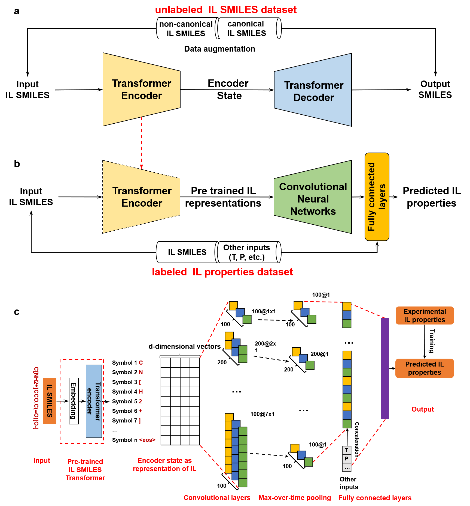

## Generalizing property prediction of ionic liquids from limited labeled data: a one-stop framework empowered by transfer learning ##

Guzhong Chen<sup>a,b</sup>, Zhen Song<sup>a,*</sup>, Zhiwen Qi<sup>a,*</sup>, Kai Sundmacher<sup>b,c</sup>

<sup>a</sup> State Key laboratory of Chemical Engineering, School of Chemical Engineering, East China University of Science and Technology, 130 Meilong Road, Shanghai 200237, China

<sup>b</sup> Process Systems Engineering, Max Planck Institute for Dynamics of Complex Technical Systems, Sandtorstr. 1, D-39106 Magdeburg, Germany

<sup>c</sup> Process Systems Engineering, Otto-von-Guericke University Magdeburg, Universitätsplatz 2, D-39106 Magdeburg, Germany

Corresponding authors: songz@ecust.edu.cn (Z. S.); zwqi@ecust.edu.cn (Z. Qi.)




This is the official implementation of "Generalizing property prediction of ionic liquids from limited labeled data: a one-stop framework empowered by transfer learning". In this work, we present a one-stop <strong><em>ILTransR</em></strong> (IL transfer learning of Representations), a pre-training fine-tuning paradigm that leverages large-scale unlabeled data for generalizing IL property prediction from limited labeled data.


## Getting Started

### Installation

Set up conda environment and clone the github repo

```
# create a new environment
$ conda create --name iltransr python=3.8
$ conda activate iltransr

# install requirements
$ pip install mxnet-cu112
$ pip install gluonnlp
$ pip install PyYAML
$ pip install rdkit-pypi==2022.3.2.1

# clone the source code of ILTransR
$ git clone https://github.com/GuzhongChen/ILTransR.git
$ cd ILTransR
```

### Dataset

You can download the original Pubchem coumpound database (access date: 2020.12.17) [here](ftp://ftp.ncbi.nlm.nih.gov/pubchem/Compound/). The IL-like dataset for pre-training can be found in `data/pubchem_illike_100.csv`. All the IL propertes datasets for fine-tuning are saved in `datasets/il properties`. 

### Pre-training

First, download 'pubchem_illike_100.csv' from [here](https://drive.google.com/drive/folders/11CJsfLyEy6frgaN934M_JpKo4YlR_6_i?usp=sharing) and put it under `ILTransR/datasets/pubchem`.

Then, preprocess the IL-like dataset, run
```
$ python preprocess_illike.py
```

To pre-train the IL Transformer on the IL-like dataset,run
```
$ python pre-train_IL_Transformer.py
```
Pre-training log can be found in `pretraining/il_transformer_128_1024.log`
### Fine-tuning 

To fine-tune the ILTransR on downstream IL properties datasets, run jupyter notebooks in `examples`.

More IL properties will be added in the future.

### Pre-trained models

Pre-trained IL Transformer can be found in `pre-training/valid_best.params`.

We also provide pre-trained models for IL properties prediction, which can be found in `iltransr/pre-trained params`. 

### Application example of ILTransR: CO2 absorbent screening

First, download 'predicted_IL_properties.csv' from [here](https://drive.google.com/drive/folders/11CJsfLyEy6frgaN934M_JpKo4YlR_6_i?usp=sharing) and put it under `ILTransR/IL screening`.

One can also do predictions with IL SMILES provieded in 'ONLY_SMILES.csv' using the notebooks provided in `ILTransR/examples`.

Then, run the jupyter notebook `ILTransR/IL screening/screening.ipynb` to reprodece the screening results.

